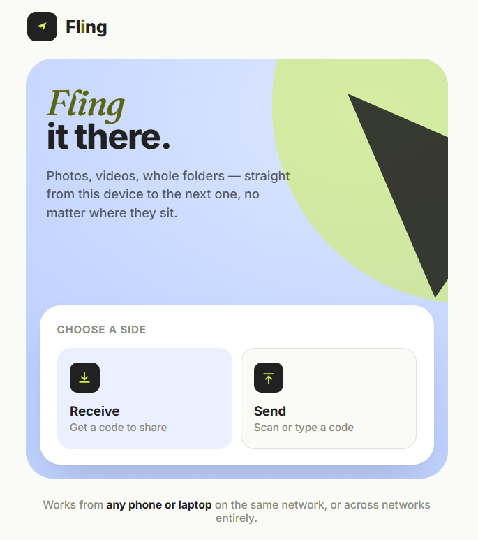

# ⚡ Fling

### Send files. Directly. Privately. Anywhere.

**Fling** is a fast, privacy-first peer-to-peer file sharing app that lets you send **photos, videos, documents, and other files directly between devices** — phone to laptop, laptop to laptop, or device to device across different networks.

No accounts.
No cloud storage.
No files sitting on a server.

Just **connect → select → Fling.**

---

## ✨ Why Fling?

Sharing files between your own devices shouldn't require uploading them to a cloud service, creating an account, or dealing with cables.

Fling uses **WebRTC peer-to-peer connections** to establish a direct connection between devices.

That means:

* 🔒 **Your files stay between your devices**
* ☁️ **No cloud storage**
* 👤 **No account required**
* 🚫 **No files stored on our servers**
* 🌍 **Works across different networks**
* 📱 **Phone ↔ Laptop**
* 💻 **Laptop ↔ Laptop**
* ⚡ **Fast direct transfers**

---

## 🚀 How It Works

Fling keeps the process incredibly simple.

### 1. 📥 Receive

One device opens Fling and taps **Receive**.

Fling generates:

* A unique **4-character connection code**
* A **QR code** for quick pairing

### 2. 🔗 Connect

On the second device, scan the QR code or enter the 4-character code.

Tap **Connect**.

### 3. 📤 Select

Choose the photos, videos, documents, or files you want to send.

### 4. ⚡ Fling

Once the peer-to-peer connection is established, the files travel **directly between the two devices using WebRTC**.

```text
┌──────────────┐                         ┌──────────────┐
│    Phone     │                         │    Laptop    │
│              │                         │              │
│   Select     │                         │   Receive    │
│    Files     │                         │              │
└──────┬───────┘                         └──────▲───────┘
       │                                        │
       │          Direct WebRTC Connection      │
       └────────────────────────────────────────┘
                         ⚡
                    File Transfer
```

---

## 🌍 Works Beyond the Same Wi-Fi

Unlike applications that depend on local-network discovery, Fling is designed around **WebRTC**, so the devices don't need to be connected to the same Wi-Fi network.

For example:

```text
📱 Phone
   │
   │ Mobile Data
   │
   ▼

      🌐 Internet

   ▲
   │ Home Wi-Fi
   │
   │
💻 Laptop
```

Your phone can be on **mobile data** while your laptop is connected to **home Wi-Fi**, and Fling can still establish a peer-to-peer connection.

---

## 🔐 Privacy by Design

Privacy isn't an optional feature in Fling — it's part of the architecture.

The server is used only for the **initial signaling/handshake** needed to help the two devices discover and establish a connection.

Once the WebRTC connection is established:

> **The actual file data does not pass through the signaling server.**

The transfer path looks like:

```text
Device A
   │
   │
   │  WebRTC P2P
   │
   ▼
Device B
```

Not:

```text
Device A
   │
   ▼
   ☁️ Server
   │
   ▼
Device B
```

### What the server does

* 🤝 Helps devices discover each other
* 🔑 Facilitates the initial connection handshake
* 📡 Exchanges signaling information

### What the server does NOT do

* ❌ Store your files
* ❌ Upload your photos
* ❌ Store your videos
* ❌ Act as a file-transfer server
* ❌ Keep copies of transferred files

---

## 🎯 Key Features

| Feature                     | Fling |
| --------------------------- | :---: |
| 📱 Phone → Laptop           |   ✅   |
| 💻 Laptop → Laptop          |   ✅   |
| 🌍 Different networks       |   ✅   |
| 📶 Same Wi-Fi required      |   ❌   |
| ☁️ Cloud storage            |   ❌   |
| 👤 Account required         |   ❌   |
| 🔢 4-character pairing code |   ✅   |
| 📷 QR pairing               |   ✅   |
| 🔒 Peer-to-peer transfer    |   ✅   |
| 📁 Photos & videos          |   ✅   |
| 📄 File sharing             |   ✅   |
| 🗄️ Files stored on server  |   ❌   |

---

## 🧠 Architecture

Fling consists of two main parts:

### Signaling

The signaling layer is responsible only for helping peers establish a connection.

```text
Device A
   │
   │ Signaling
   ▼
Signaling Server
   │
   │ Signaling
   ▼
Device B
```

After the connection is established, the signaling server is no longer responsible for transferring the files.

### WebRTC

The actual file transfer happens through a **WebRTC DataChannel**.

```text
┌───────────────┐
│    Device A   │
│               │
│   Browser     │
└───────┬───────┘
        │
        │ WebRTC
        │ DataChannel
        │
        ▼
┌───────────────┐
│    Device B   │
│               │
│   Browser     │
└───────────────┘
```

---

## 🛠️ Tech Stack

Fling is built around modern browser technologies:

* **WebRTC** — Peer-to-peer communication
* **WebRTC DataChannel** — Direct file transfer
* **QR Code** — Fast device pairing
* **Web APIs** — File selection and browser-based transfer
* **Signaling Server** — Initial peer discovery and connection negotiation

---

## ⚡ User Flow

```text
             ┌──────────────┐
             │    Fling     │
             └──────┬───────┘
                    │
           ┌────────┴────────┐
           │                 │
           ▼                 ▼
      📥 Receive          📤 Connect
           │                 │
           ▼                 ▼
     Generate Code       Scan / Enter
       + QR Code             Code
           │                 │
           └────────┬────────┘
                    │
                    ▼
             🤝 Peer Connected
                    │
                    ▼
              📁 Select Files
                    │
                    ▼
              ⚡ Direct Transfer
                    │
                    ▼
                ✅ Complete
```

---

## 🎨 Designed to Be Simple

Fling follows one principle:

> **File sharing should feel effortless.**

There are no complicated menus, accounts, folders, or cloud dashboards.

Just:

**Receive → Connect → Select → Fling.**

---

## 🔒 Security & Privacy

Fling is designed to minimize the amount of information that needs to leave your devices.

The signaling service is used to coordinate the initial connection, while the actual file transfer is performed through the peer-to-peer WebRTC connection.

However, **WebRTC does not automatically guarantee anonymity or end-to-end privacy in every network configuration**, so users should still avoid transferring sensitive information to devices they do not trust.

---

## 📸 Preview

Here is a look at Fling in action:




## 💡 The Idea Behind Fling

Fling was built around a simple question:

**Why should sending a file from my phone to my laptop require uploading it somewhere first?**

You shouldn't need:

* A USB cable
* A cloud drive
* An account
* A messaging app
* A third-party file-sharing service

Sometimes you just want to send a file.

**Fling lets you do exactly that.**

---

## 🌟 Vision

Fling aims to make **private, direct device-to-device file sharing** as simple as sending a message.

No unnecessary infrastructure.

No permanent storage.

No complicated setup.

Just two devices and a connection.

---

## 🤝 Contributing

Contributions, ideas, bug reports, and improvements are welcome.

If you have an idea that can make Fling faster, simpler, or more private, feel free to contribute.

---

## 📄 License

This project is open source. Add your preferred license here, such as **MIT License**, if applicable.

---

<div align="center">

### ⚡ Fling

**Send it. Don't upload it.**

Made with ❤️ for simple, private file sharing.

</div>
